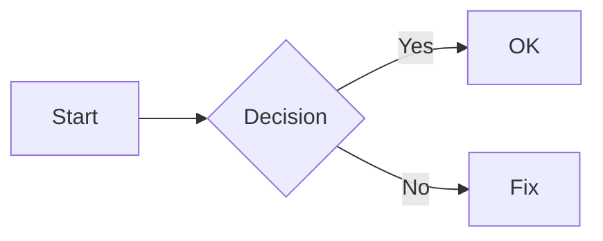

# មើល .md ◇ merl.md

A lightweight, bilingual (English/Khmer) markdown previewer with live rendering, syntax highlighting, Mermaid diagrams, dark mode, custom accent colors, and responsive layout.

## Features

- **Live preview** — split-pane editor/preview with draggable divider
- **Full GFM support** — headings, bold, italic, strikethrough, lists, task lists, tables, blockquotes, links, images, inline code, fenced code blocks with syntax highlighting
- **Mermaid diagrams** — ` ```mermaid ` code blocks render as flowcharts, sequence diagrams, Gantt charts, and more
- **Syntax highlighting** — atom-one-dark theme via highlight.js (13+ languages)
- **Dark / light mode** — theme toggle with smooth transitions
- **Custom accent color** — 12 preset swatches + custom color picker; affects links, checkboxes, inline code, header underlines, blockquote bars, and more
- **Bilingual fonts** — 13 English fonts + 17 Khmer fonts from Google Fonts, loaded dynamically
- **Preview font zoom** — ±1px adjustable (12–24px), persisted
- **File operations** — open `.md` files, download rendered HTML (self-contained, theme-aware)
- **Responsive** — desktop (side-by-side), tablet (icon-only toolbar), mobile (tabbed editor/preview)
- **All settings persisted** — fonts, accent color, theme, split position, font size via localStorage

## Tech Stack

| Tool | Purpose |
|------|---------|
| [Vite](https://vitejs.dev/) + [React 19](https://react.dev/) | Build tool & UI framework |
| [TypeScript](https://www.typescriptlang.org/) | Type safety |
| [react-markdown](https://github.com/remarkjs/react-markdown) | Markdown → React |
| [remark-gfm](https://github.com/remarkjs/remark-gfm) | GFM task lists, tables, strikethrough |
| [rehype-highlight](https://github.com/rehypejs/rehype-highlight) | Code syntax highlighting |
| [Mermaid](https://mermaid.js.org/) | Diagram rendering |
| [Lucide React](https://lucide.dev/) | Icons |
| [Google Fonts](https://fonts.google.com/) | English & Khmer typefaces |

## Quick Start

```bash
npm install
npm run dev
```

Open the URL shown in the terminal (default `http://localhost:5173`).

### Build for production

```bash
npm run build
npm run preview
```

Output goes to `dist/`.

## Usage

| Action | How |
|--------|-----|
| Edit markdown | Type in the left pane — preview updates instantly |
| Open `.md` file | Click **Open** (or the upload icon) |
| Download HTML | Click **HTML** — saves `YYYYMMDD-HHmmss-merl-md.html` |
| Toggle theme | Click **Dark** / **Light** |
| Change accent | Click **Accent** (colored dot button) — pick a preset or custom color |
| Change fonts | Click **Font** — select English and/or Khmer typeface |
| Zoom preview | Use the **−** / **+** buttons or pinch on mobile |
| Clear editor | Click the trash icon in the editor pane header |
| Resize panes | Drag the divider between editor and preview |
| Mobile tabs | Tap **Editor** or **Preview** to switch views |

### Mermaid

Render diagrams with standard fenced code blocks:

````markdown

````

The diagram is rendered live in the preview pane and adapts to light/dark mode.

### Available Fonts

**English:** Inter, Roboto, Poppins, Open Sans, Lato, Montserrat, Noto Sans, Source Sans 3, Nunito, Quicksand, Work Sans, DM Sans, Karla

**Khmer:** Noto Sans Khmer, Google Sans, Kantumruy Pro, Koh Santheap, Battambang, Moul, Bayon, Suwannaphum, Content, Siemreap, Freehand, Nokora, Preah Vihear, Hanuman, Metal, Dangrek, Moulpali

## Project Structure

```
src/
├── App.tsx              # Main app — state, persistence, layout, HTML export
├── index.css            # All styles (themes, layout, components, responsive)
├── fonts.ts             # Font listings & Google Fonts URL builder
├── types.ts             # TypeScript interfaces
├── main.tsx             # React entry point
└── components/
    ├── Editor.tsx       # Markdown textarea
    ├── Preview.tsx      # ReactMarkdown + Mermaid rendering
    ├── Toolbar.tsx      # Top toolbar with all controls
    ├── FontSettings.tsx # Font selector popover
    └── AccentPicker.tsx # Accent color picker popover
```

## Responsive Breakpoints

| Range | Layout | Toolbar |
|-------|--------|---------|
| ≥1024px | Side-by-side split panes | Full labels and stats |
| 768–1023px | Side-by-side split panes | Icon-only buttons, no stats |
| <768px | Tabbed (editor / preview) | Icon-only, zoom hidden, brand condensed |
| <420px | Tabbed | Ultra-compact |

## License

MIT
